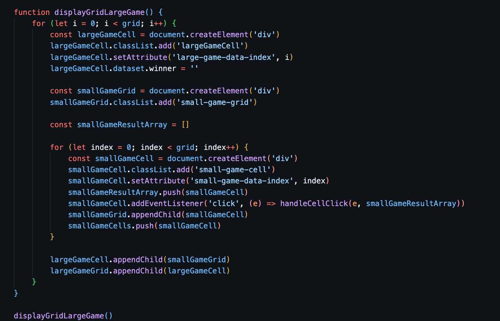
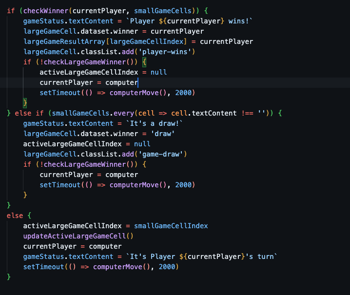
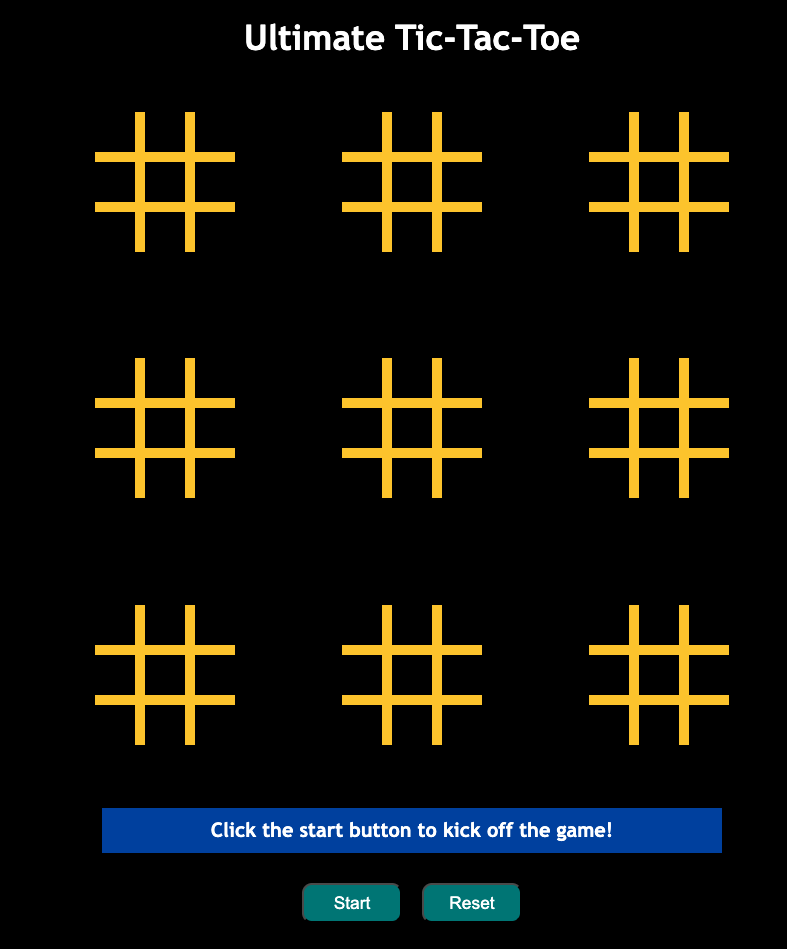

# Final Project: Ultimate Tic-Tac-Toe 

## What is ultimate tic-tac-toe? 

It is a board game composed of nine tic-tac-toe boards arranged in a 3 × 3 grid. Players take turns playing on the smaller tic-tac-toe boards until one of them wins on the larger board. Compared to traditional tic-tac-toe, strategy in this game is conceptually more difficult and has proven more challenging for computers. 

* * (Source: Wikipedia)

## Game rules

1.	There are 2 players for this game – Player X and Player O (Computer).
2.	The two players take turns, starting with X. The game starts with X playing wherever they want in any of the 81 empty spots.
3.	Next the opponent plays, however they are forced to play in the small board indicated by the relative location of the previous move. For example, if X plays in the top right square of a small (3 × 3) board, then O has to play in the small board located at the top right of the larger board. Playing any of the available spots decides in which small board the next player plays.
4.	If a move is played so that it is to win a small board by the rules of normal tic-tac-toe, then the entire small board is marked as won by the player in the larger board.
5.	Once a small board is won by a player or it is filled completely, no more moves may be played in that board. If a player is sent to such a board, then that player may play in any other board.
6.	Game play ends when either a player wins the larger board or there are no legal moves remaining, in which case the game is a draw.

## Technologies Used

JavaScript, HTML, CSS, Git and GitHub

## 1) Planning 

The first day of the project was spent on planning the game main’s functionality, i.e. game rules, determining programmatically the available spots for each player’s move and capturing the results. I started with creating the grid for the game.

After that, I created the click function for Player X and Player O (computer) to visualize the game-playing (unfortunately I had never played this game before this project). I finally decided to use a ‘functional’ approach, meaning that the game logic would be distributed among a number of small reusable, predictable functions. 

 ## 2) Functionality

I have created the click function for players based on the game rules. This relies on other functions I created in the code, i.e. available spots and check winner. This is quite challenging as there are some overriding issue while testing the game. 

 
As for the winning function, there are 2 separate functions to check the single board and main board. 

## 3) Styling, DOM manipulation and UX

I kept the styling simple. For every move, the available board is enable with white border programmatically and visual feedback for the winning single board.
 

## Blockers 
I was confused with the order of the codes and the array used to check each winner. I had to test the game numerous time and console log the issues. 

## Bugs
I have fixed some bugs in the game and it works fine.

## Key Takeaways
List down all functions needed for the game first and possible issues. 

